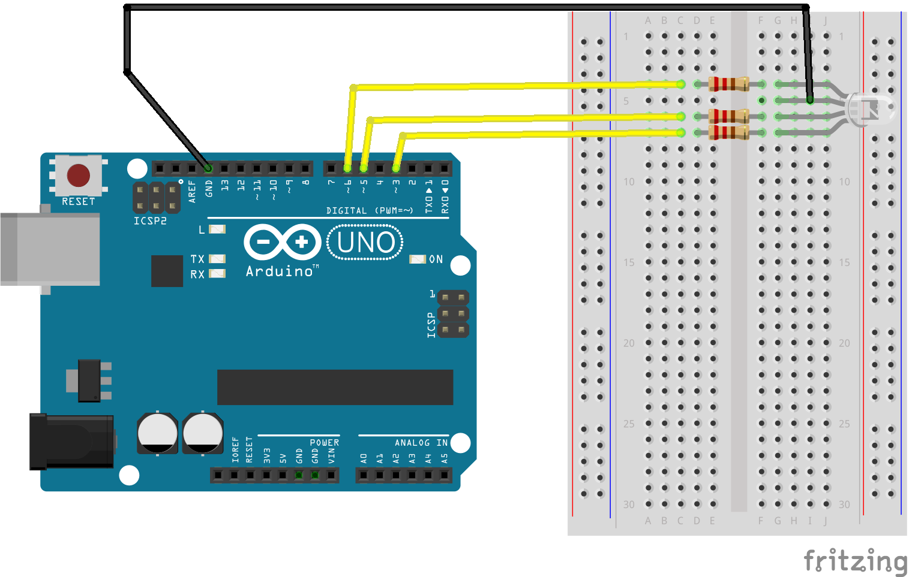
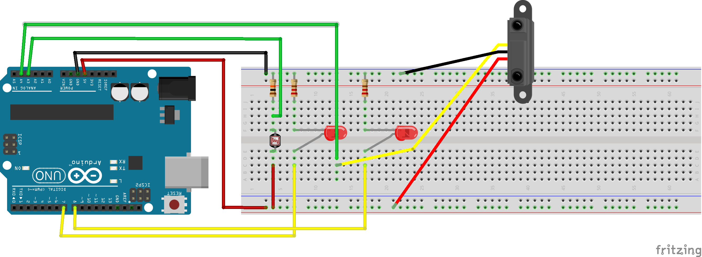

# Johnny-Five Basic Examples with Arduino Uno

## Install: Prepare Uno as Client

### PreRequisites

Download and install the [Arduino IDE](https://www.arduino.cc/en/Main/Software) (free; Mac, Windows, Linux).

Clone this repository.

### Firmata Firmware

1. Open Arduino IDE
2. Connect the Uno with USB
3. In the `File -> Examples` menu, find the `Firmata` submenu and select `StandardFirmata`
4. Upload the `StandardFirmata` sketch to the Arduino

### Johnny-Five and Example Dependencies

```
cd <directory with this repo>
npm install
```

## Examples

### Hello, World

[Hello, World](examples/01-hello.js) and [Modified Hello World](examples/02-hello-stop.js) don't require any wiring except plugging Arduino into USB on your computer.

```
node examples/01-hello.js
```

```
node examples/02-hello-stop.js
```

### RGB LED

[RGB display of website colors](examples/03-rgb.js) is based on the following schematic:



```
node examples/03-rgb.js
```

### Analog Sensors

The following schematic is for both the [photoresistor](examples/04-photoresistor.js) and [proximity sensor](examples/05-proximity.js) examples.



```
node examples/04-photoresistor.js
```

```
node examples/05-proximity.js
```

### Serial Data

To run the [compass-north alarm](examples/06-compass.js) example, you'll need the following setup:


```
node examples/06-compass.js
```
